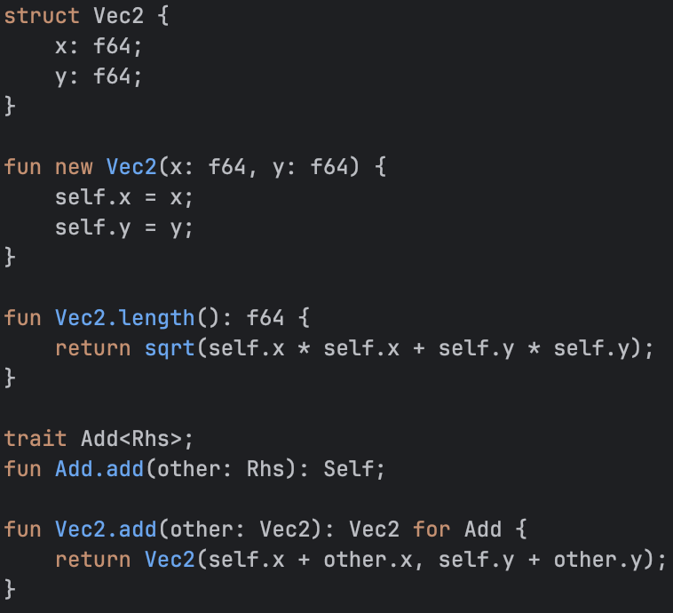

# The Roxy scripting language

<p align="center">
  
</p>

This is Roxy, an embeddable scripting language targeted towards game development.

The main objectives are:

- A statically typed language that runs on a bytecode VM (with optional AOT compilation via C code generation)
- A GC-less language which uses [constraint references](https://verdagon.dev/blog/vale-memory-safe-cpp) and [generational references](https://verdagon.dev/blog/generational-references) for memory management
- A language that can be easily embedded in C++ codebases with minimal overhead

Currently this project is work in progress. But there's quite a lot implemented already, look at the examples/ for what you can already do!

See the docs/ folder for more detailed design notes about the language.

## Building

Requires CMake, Ninja, and a C++20 compiler.

```bash
cmake -B build -G Ninja -DCMAKE_EXPORT_COMPILE_COMMANDS=ON
ninja -C build
```

On Windows, with clang-cl:

```bash
cmake -B build -G Ninja -DCMAKE_C_COMPILER=clang-cl -DCMAKE_CXX_COMPILER=clang-cl -DCMAKE_MT="C:/Program Files/LLVM/bin/llvm-mt.exe"
ninja -C build
```

This builds three executables: `roxy` (the CLI), `roxy_tests`, and
`roxy_lsp_server`. The default build is `-O0`; for anything performance-related
configure a separate `-DCMAKE_BUILD_TYPE=RelWithDebInfo` build directory.

## Running

```bash
./build/roxy examples/hello.roxy
```

A program's entry point is `fun main(): i32`. Modules imported by the source file
are auto-discovered from its directory. Useful flags:

| Flag | Effect |
|------|--------|
| `--dump-ir` | Print the SSA IR to stderr after compilation |
| `--dump-bc` | Print the bytecode disassembly to stderr |
| `--time` | Per-phase compile timing, and the compile-vs-execute split |
| `--repeat=N` | Compile N times and report averaged timings |

Run the test suite with `./build/roxy_tests` (see `CLAUDE.md` for suite filters —
the C-backend cases shell out to a system C++ compiler, the rest don't).

## Examples

| File | Shows |
|------|-------|
| `examples/hello.roxy` | The smallest complete program |
| `examples/fibonacci.roxy` | Recursion |
| `examples/quicksort.roxy` | `inout` container params, in-place mutation |
| `examples/showcase_short.roxy` | Structs, constructors, methods, traits, operator overloading |
| `examples/showcase.roxy` | The above plus enums, `when`, generics, trait bounds, `uniq` ownership |
| `examples/sudoku.roxy` | `uniq`/`weak` ownership at scale: an owner holding `List<uniq Cell>`, groups holding `List<weak Cell>`, cells holding `weak` back-references, solved by backtracking |
| `examples/lox/` | A complete Lox interpreter (~3.3k lines) — the largest program written in Roxy |

Known bugs and incomplete work are tracked in `TODO.md`; the roadmap is in
`docs/overview.md`.
